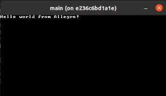

# Asteroids

A C based asteroids clone using the
[Allegro](https://github.com/liballeg/allegro5) framework.

## Day 0

Setup my environment in Docker using the `ubuntu:20.04` image for the
base. Following the
[quickstart](https://github.com/liballeg/allegro_wiki/wiki/Quickstart)
for allegro, I added `liballegro*5.2` and `liballegro*5-dev` to be
installed in the `Dockerfile`. Made my own version of the [hello
world](https://github.com/liballeg/allegro_wiki/wiki/Quickstart#hello-world)
program, and added a `Makefile` that
[compiles](https://github.com/liballeg/allegro_wiki/wiki/Quickstart#hello-world)
the program.

When trying to build the container though I got the following.

```
/usr/bin/ld: /tmp/ccbgC57M.o: in function `main':
main.c:(.text+0x2f): undefined reference to `al_install_system'
/usr/bin/ld: main.c:(.text+0x34): undefined reference to `al_install_keyboard'
/usr/bin/ld: main.c:(.text+0x45): undefined reference to `al_create_timer'
/usr/bin/ld: main.c:(.text+0x4e): undefined reference to `al_create_event_queue'
/usr/bin/ld: main.c:(.text+0x61): undefined reference to `al_create_display'
/usr/bin/ld: main.c:(.text+0x6a): undefined reference to `al_create_builtin_font'
/usr/bin/ld: main.c:(.text+0x73): undefined reference to `al_get_keyboard_event_source'
/usr/bin/ld: main.c:(.text+0x85): undefined reference to `al_register_event_source'
/usr/bin/ld: main.c:(.text+0x91): undefined reference to `al_get_display_event_source'
/usr/bin/ld: main.c:(.text+0xa3): undefined reference to `al_register_event_source'
/usr/bin/ld: main.c:(.text+0xaf): undefined reference to `al_get_timer_event_source'
/usr/bin/ld: main.c:(.text+0xc1): undefined reference to `al_register_event_source'
/usr/bin/ld: main.c:(.text+0xd4): undefined reference to `al_start_timer'
/usr/bin/ld: main.c:(.text+0xe7): undefined reference to `al_wait_for_event'
/usr/bin/ld: main.c:(.text+0x125): undefined reference to `al_is_event_queue_empty'
/usr/bin/ld: main.c:(.text+0x13d): undefined reference to `al_map_rgb'
/usr/bin/ld: main.c:(.text+0x16a): undefined reference to `al_clear_to_color'
/usr/bin/ld: main.c:(.text+0x17e): undefined reference to `al_map_rgb'
/usr/bin/ld: main.c:(.text+0x1c6): undefined reference to `al_draw_text'
/usr/bin/ld: main.c:(.text+0x1cb): undefined reference to `al_flip_display'
/usr/bin/ld: main.c:(.text+0x1e3): undefined reference to `al_destroy_font'
/usr/bin/ld: main.c:(.text+0x1ef): undefined reference to `al_destroy_display'
/usr/bin/ld: main.c:(.text+0x1fb): undefined reference to `al_destroy_timer'
/usr/bin/ld: main.c:(.text+0x207): undefined reference to `al_destroy_event_queue'
collect2: error: ld returned 1 exit status
make: *** [Makefile:2: output] Error 1
The command '/bin/sh -c make' returned a non-zero code: 2
```

The key to the above error is the `undefined reference`, which means that
the allegro libraries are linking properly. I fixed this issue by
replacing what the quickstart suggests with `-lallegro -lallegro_font` in
the `Makefile`.

Running the docker image results in `main:
/build/allegro5-AcGyua/allegro5-5.2.6.0/src/events.c:166:
al_register_event_source: Assertion 'source' failed.`. I have no clue
what this means, but looking at
[`events.c:166`](https://github.com/liballeg/allegro5/blob/master/src/events.c#L166),
we can see its a test assertion of the variable `source` that is failing.
If we look in `main.c`, we can see that we are calling
`al_register_event_source` three times and passing `display` during one
of those calls. My assumption is that `display` is NULL since the
container doesnt have a display by default. To fix this I ran the
following.

```
docker run \
	-v /tmp/.X11-unix:/tmp/.X11-unix \
	-e "DISPLAY=unix${DISPLAY}" \
	--device /dev/dri \
	--name dasteroids \
	asteroids
```

From what I understand after some searching, `/tmp/.X11-unix` is a [unix
domain socket](https://www.man7.org/linux/man-pages/man7/unix.7.html)
(`man unix`), `$DISPLAY` is the [X server display name]() (`man x`), and
`/dev/dri` is the [direct rendering
manager](https://www.daemon-systems.org/man/drm.4.html) (`man drm`). I
will explore these in more detail next time, but for now lets see the
results.


