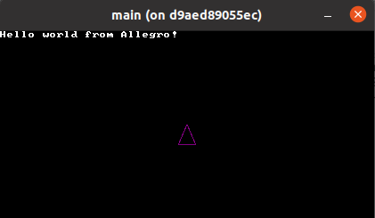
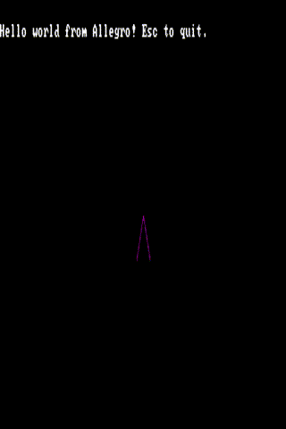

# Dasteroids

A C based asteroids clone using the
[Allegro](https://github.com/liballeg/allegro5) framework. The primary
purpose of this project is to continue my learning in C.

# Getting Started

`./init build && ./init container`

# Notes

## Day 0

Setup my environment in Docker using the `ubuntu:20.04` image for the
base. Following the
[quickstart](https://github.com/liballeg/allegro_wiki/wiki/Quickstart)
for allegro, I added `liballegro*5.2` and `liballegro*5-dev` to be
installed in the `Dockerfile`. Made my own version of the [hello
world](https://github.com/liballeg/allegro_wiki/wiki/Quickstart#hello-world)
program, and added a `Makefile` that
[compiles](https://github.com/liballeg/allegro_wiki/wiki/Quickstart#hello-world)
the program.

When trying to build the container though I got the following.

```
/usr/bin/ld: /tmp/ccbgC57M.o: in function `main':
main.c:(.text+0x2f): undefined reference to `al_install_system'
/usr/bin/ld: main.c:(.text+0x34): undefined reference to `al_install_keyboard'
/usr/bin/ld: main.c:(.text+0x45): undefined reference to `al_create_timer'
/usr/bin/ld: main.c:(.text+0x4e): undefined reference to `al_create_event_queue'
/usr/bin/ld: main.c:(.text+0x61): undefined reference to `al_create_display'
/usr/bin/ld: main.c:(.text+0x6a): undefined reference to `al_create_builtin_font'
/usr/bin/ld: main.c:(.text+0x73): undefined reference to `al_get_keyboard_event_source'
/usr/bin/ld: main.c:(.text+0x85): undefined reference to `al_register_event_source'
/usr/bin/ld: main.c:(.text+0x91): undefined reference to `al_get_display_event_source'
/usr/bin/ld: main.c:(.text+0xa3): undefined reference to `al_register_event_source'
/usr/bin/ld: main.c:(.text+0xaf): undefined reference to `al_get_timer_event_source'
/usr/bin/ld: main.c:(.text+0xc1): undefined reference to `al_register_event_source'
/usr/bin/ld: main.c:(.text+0xd4): undefined reference to `al_start_timer'
/usr/bin/ld: main.c:(.text+0xe7): undefined reference to `al_wait_for_event'
/usr/bin/ld: main.c:(.text+0x125): undefined reference to `al_is_event_queue_empty'
/usr/bin/ld: main.c:(.text+0x13d): undefined reference to `al_map_rgb'
/usr/bin/ld: main.c:(.text+0x16a): undefined reference to `al_clear_to_color'
/usr/bin/ld: main.c:(.text+0x17e): undefined reference to `al_map_rgb'
/usr/bin/ld: main.c:(.text+0x1c6): undefined reference to `al_draw_text'
/usr/bin/ld: main.c:(.text+0x1cb): undefined reference to `al_flip_display'
/usr/bin/ld: main.c:(.text+0x1e3): undefined reference to `al_destroy_font'
/usr/bin/ld: main.c:(.text+0x1ef): undefined reference to `al_destroy_display'
/usr/bin/ld: main.c:(.text+0x1fb): undefined reference to `al_destroy_timer'
/usr/bin/ld: main.c:(.text+0x207): undefined reference to `al_destroy_event_queue'
collect2: error: ld returned 1 exit status
make: *** [Makefile:2: output] Error 1
The command '/bin/sh -c make' returned a non-zero code: 2
```

The key to the above error is the `undefined reference`, which means that
the Allegro libraries are not linking properly. I fixed this issue by
replacing what the quickstart suggests with `-lallegro -lallegro_font` in
the `Makefile`. For more information look at `man gcc` and search for
`-llibrary`.

Running the docker image results in `main:
/build/allegro5-AcGyua/allegro5-5.2.6.0/src/events.c:166:
al_register_event_source: Assertion 'source' failed.`. I have no clue
what this means, but looking at
[`events.c:166`](https://github.com/liballeg/allegro5/blob/master/src/events.c#L166),
we can see its a test assertion of the variable `source` that is failing.
If we look in `main.c`, we can see that we are calling
`al_register_event_source` three times and passing `display` during one
of those calls. My assumption is that `display` is NULL since the
container doesnt have a display by default. To fix this I drew from
[Jess Frazelles .dockerfunc
file](https://github.com/jessfraz/dotfiles/blob/master/.dockerfunc)
(more specifically from her [vlc
implementation](https://github.com/jessfraz/dotfiles/blob/master/.dockerfunc#L1178)).

```
docker run \
	-v /tmp/.X11-unix:/tmp/.X11-unix \
	-e "DISPLAY=unix${DISPLAY}" \
	--device /dev/dri \
	--name dasteroids \
	asteroids
```

**Note: `xhost local:root` was required**, see [here for more
info](https://github.com/jessfraz/dockerfiles/issues/6#issuecomment-78040995)

From what I understand after some searching, `/tmp/.X11-unix` is a [unix
domain socket](https://www.man7.org/linux/man-pages/man7/unix.7.html)
(`man unix`), `$DISPLAY` is the [X server display name]() (`man x`), and
`/dev/dri` is the [direct rendering
manager](https://www.daemon-systems.org/man/drm.4.html) (`man drm`). I
will explore these in more detail next time, but for now lets see the
results.


## Day 1

Yesterday I got my environment and a hello world Allegro example running
within a docker container. Today I am going to aim to get a spaceship to
render on the window, and maybe moving around.

The first thing to do is to create a `Spaceship` struct, a default
constructor/deconstructor, and a draw function (which is taken from the
Head First C book). When trying to build the container, it results in
`undefined reference to 'al_draw_line'`. After finding
[`al_draw_line`](https://liballeg.org/a5docs/trunk/primitives.html#al_draw_line),
I found that I needed `#include <allegro5/allegro_primitives.h>` and
`-lallegro_primitives`. The container builds now, but when trying to run,
it outputs `al_draw_prim: Assertion 'addon_initialized' failed.`, which
after a quick search, found that I was missing
`al_init_primitive_addons();` before the main loop. It works, but no
ship.

I changed from the 4 calls of `al_draw_line`, to a single call of
`al_draw_triangle`, which will hopefully simplify things. Rather than
hardcoding the `x,y` coordinates, Ive set `ship->screen_x` to `screen_w /
2` and `ship->screen_y` to `screen_h / 2`. This will always set the
starting `x,y` coordinates of the ship to the center of the screen
resolution. It also means that when we call `al_draw_triangle`, we can
leverage the starting coordinates for drawing the triangle. It looks like
the following.

```C
al_draw_triangle(ship->screen_x, ship->screen_y,
		ship->screen_x+10, ship->screen_y+23,
		ship->screen_x-10, ship->screen_y+23,
		ship->color, ship->thickness);
```

Behold our beautiful purple triangle.



Adding movement to the ship was as easy as the following.

```C

bool running = true;

while (running) {
	al_wait_for_event(queue, &event);

	if (event.type == ALLEGRO_EVENT_TIMER)
		redraw = true;

	if (event.type == ALLEGRO_EVENT_KEY_DOWN) {
		switch (event.keyboard.keycode) {
		caes ALLEGRO_KEY_W:
			ship->location.y -= ship->speed;
			break;
		caes ALLEGRO_KEY_A:
			ship->location.x -= ship->speed;
			break;
		caes ALLEGRO_KEY_S:
			ship->location.y += ship->speed;
			break;
		caes ALLEGRO_KEY_D:
			ship->location.x += ship->speed;
			break;
		caes ALLEGRO_KEY_ESCAPE:
			running = false;
			break;
		}
	}
}
```

This is only the first iteration of the movement, tomorrow I will work on
turning and improving on the movement. The first refactor I made in the
`Dockerfile` was changing from `ubuntu:20.04` to `ubuntu:18.04`. Tried
playing around with `alpine:latest`, using `allegro`/`allegro-dev` but
get the following error now. Time to find `libGL` for `alpine`. For now
shifting to `ubuntu:18.04` has already shaved ~200MB off the docker
image.

```BASH
libGL error: MESA-LOADER: failed to open iris: Error loading shared
library /usr/lib/xorg/modules/dri/iris_dri.so: No such file or directory (search paths /usr/lib/xorg/modules/dri, suffix _dri)
libGL error: failed to load driver: iris
libGL error: MESA-LOADER: failed to open swrast: Error loading shared
library /usr/lib/xorg/modules/dri/swrast_dri.so: No such file or directory (search paths /usr/lib/xorg/modules/dri, suffix _dri)
libGL error: failed to load driver: swrast
libGL error: MESA-LOADER: failed to open iris: Error loading shared
library /usr/lib/xorg/modules/dri/iris_dri.so: No such file or directory (search paths /usr/lib/xorg/modules/dri, suffix _dri)
libGL error: failed to load driver: iris
libGL error: MESA-LOADER: failed to open swrast: Error loading shared library /usr/lib/xorg/modules/dri/swrast_dri.so: No such file or directory (search paths /usr/lib/xorg/modules/dri, suffix _dri)
libGL error: failed to load driver: swrast
X Error of failed request:  BadValue (integer parameter out of range for operation)
  Major opcode of failed request:  150 (GLX)
  Minor opcode of failed request:  24 (X_GLXCreateNewContext)
  Value in failed request:  0x0
  Serial number of failed request:  28
  Current serial number in output stream:  29
```

## Day 2

After looking up the above error, I found the missing library
`mesa-dri-intel`. We now have a working docker container using `alpine`
for the base image! The container went from 741MB to 427MB, which is
about 42% reduction of size.

We left off yesterday with basic movement implemented, so today is going
to be focusing on refining the movement and making it more like the
classic asteroids. That means implementing Newtons first law of motion
(an object in motion remains so unless acted upon by a force), and
implementing turning or
[yaw](https://en.wikipedia.org/wiki/Yaw_%28rotation%29). Before I add
those, I want to make a boundary for the game, so the player cant go off
the screen. This is super easy with `fmod` (floating-point remainder
function), and looks like the following.

```C
ship->location.x = fmod(ship->location.x + sw, sw);
ship->location.y = fmod(ship->location.y + sh, sh);
```

After looking into applying a rotation to a triangle, I came across [this
stackoverflow post](https://stackoverflow.com/a/44748651). In this post
one of the answers suggested defining the ship shape using a variable
number of vertices. I really like this idea, since I would like to add a
feature down the road where after a certain number of accumulated points,
your ship gets upgraded. For now though, I am going to hardcode the
number of vertices to two. Building and running gives us our new ship! We
still need to add the changes to implement a yaw axis, which was
accomplished by making the following changes to `main.c`.

```C
switch (event.keyboard.keycode) {
	case ALLEGRO_KEY_W:
		ship->location.y -= ship->acceleration_speed;
		break;
	case ALLEGRO_KEY_A:
		ship->yaw -= ship->turn_speed;
		break;
	case ALLEGRO_KEY_S:
		ship->location.y += ship->acceleration_speed;
		break;
	case ALLEGRO_KEY_D:
		ship->yaw += ship->turn_speed;
		break;
	case ALLEGRO_KEY_ESCAPE:
		running = false;
		break;
}
```

The `turn_speed` value is set to `M_E / 10`, which is `.27182818284...`.
You can see the full constant at `/usr/include/math.h`.

We now have a ship with a yaw axis!



I will spend tomorrow working on getting movement in the direction of the
yaw axis, and do a more in depth review of the code suggested in the
stack overflow answer.

## Day 3

Yesterday we discovered a better way to structure the ship, and got the
ship turning on a yaw axis. First lets break down what was suggested in
the stack overflow post.

```C
typedef struct {
    double  x;
    double  y;
} vec2d;

typedef struct {
    vec2d        center;
    size_t       vertices;
    const vec2d *shape;     /* Un-rotated ship vertices */
    double       direction; /* Ship direction, in radians */
    vec2d       *vertex;    /* Rotated ship vertices */
} Ship;

const vec2d default_shape[] = {
    {   0.0, -5.0 },
    { -15.0, 25.0 },
    {  15.0, 25.0 },
};

void updateShip(Ship *ship)
{
    const double c = cos(ship->direction);
    const double s = sin(ship->direction);
    size_t       i;

    for (i = 0; i < ship->vertices; i++) {
        ship->vertex[i].x = ship->center.x +
					c*ship->shape[i].x - s*ship->shape[i].y;
        ship->vertex[i].y = ship->center.y +
					s*ship->shape[i].x + c*ship->shape[i].y;
    }
}

void initShip(Ship *ship, const size_t vertices, const vec2d *shape)
{
    ship->center.x = 0.5 * SCREEN_W;
    ship->center.y = 0.5 * SCREEN_H;

    if (vertices > 2 && shape != NULL) {
        ship->vertices = vertices;
        ship->shape    = shape;
    } else {
        ship->vertices = (sizeof default_shape) /
					(sizeof default_shape[0]);
        ship->shape    = default_shape;
    }

    ship->direction = 0;

    ship->vertex = malloc(ship->vertices * sizeof ship->vertex[0]);
    if (!ship->vertex) {
        fprintf(stderr, "Out of memory.\n");
        exit(EXIT_FAILURE);
    }

    updateShip(ship);
}
```

The `vec2d` struct represents a 2 dimensional vector and is used for
three things in the `Ship` struct: `center`, `shape`, and `vertex`. The
properties of `Ship` are self explanatory.

The `default_shape` variable is an array of `vec2d` structs which contain
the coordinates for an unrotated ship. It is important to note that even
though there are three vertices, only two will be visible unless youre
working in 3D.

The `update_ship` function is where the maths comes in. Two variables are
declared (`c` and `s`) and are set to the `cos` and `sin` values of
`ship->direction`. Then, for the number of `ship->vertices`, it applies a
2D rotation.

Finally, `init_ship`, is a function that initializes a given `ship`
variable. It sets `ship->center` to the center of the screen and sets
`ship->direction` to `0`. If the given `vertices` is greater than two and
`shape` is not `NULL`, then use them for `ship->vertices` and
`ship->shape`. Otherwise use `default_shape` and the result of
`(sizeof default_shape) / (sizeof default_shape[0])`. Printing out the
values gives us `Sizeof(default_ship): 24 | Sizeof(default_ship[0]): 8
== 3`. So where is the `24` and `8` coming from? If we print
`sizeof(float)`, we get `4`. Since there are six floats in
`default_ship`, the total size is `24`. The size of the first element
(`default_ship[0]`) is `{ 0.0, -5.0 }` is what gives us the `8`. What
this means is we can add or remove any number of elements and this will
scale with any size of `default_shape`. Finally, the code is calling
`malloc` and passing `ship->vertices * sizeof ship->vertex[0]` (3 * 8).
If you're confused by the comment and what the purpose of `ship->vertex`
is like I was, then think about it as the variable used for storing *all*
rotated vertices of the ship. To better explain this, I put a print
statement in the `update_ship` loop and got the following.

```
ship->vertex[0].x: 640.000000 | ship->vertex[0].y: 360.000000
ship->vertex[1].x: 630.000000 | ship->vertex[1].y: 385.000000
ship->vertex[2].x: 650.000000 | ship->vertex[2].y: 385.000000
```

So how is it able to store multiple `vertex` variables in `vec2d
*vertex`? From what I understand, when dealing with pointers and
dynamically allocated memory, you can store any number of values as long
as there is enough allocated space. So in the case of `ship->vertex`, it
actually stores a variable number of `vec2d` structs. `TODO: verify with
someone more exprienced in C.`

I added an additional feature which draws lines across the x and y axis
of the screen using `ship->location.x` and `ship->location.y`. This still
needs tweaking, as it does not rotate with the ship.

```C
// draw line across the screen along the x axis
al_draw_line(ship->location.x-sw, ship->location.y,
	ship->location.x+sw, ship->location.y,
	al_map_rgba_f(1, 0, 0, 1), 1);

// draw line across the screen along the y axis
al_draw_line(ship->location.x, ship->location.y+sh,
	ship->location.x, ship->location.y-sh,
	al_map_rgba_f(1, 0, 0, 1), 1);
```
